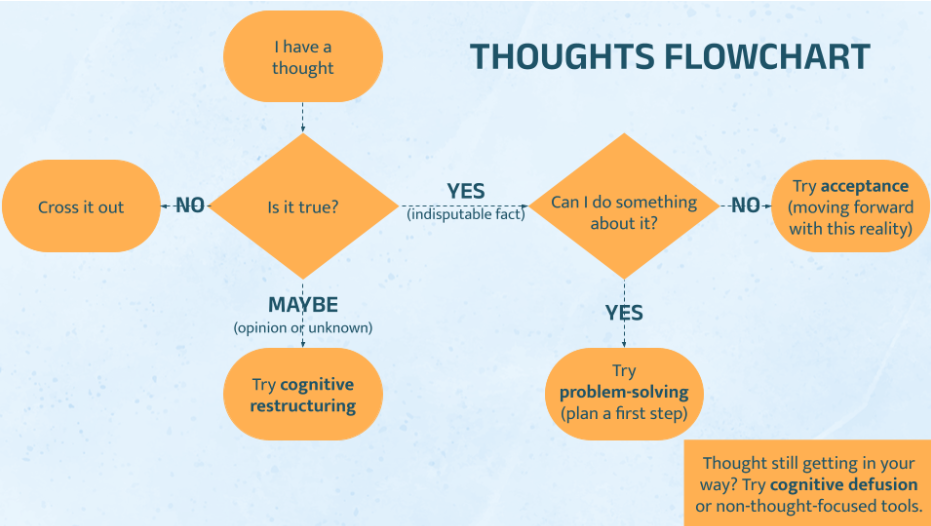

# Thought Management Tool

This project provides a set of tools to help manage thoughts and implement Cognitive Behavioral Therapy (CBT) techniques. It's based on the CBT lab from Rethink Wellbeing (https://www.rethinkwellbeing.org/services).



## Description

This tool helps break the thought-emotion and thought-behavior links in the CBT cycle. It provides a structured approach to capturing, addressing, and processing unhelpful thoughts or ruminations using various cognitive techniques.

## Directory Structure

```
├── add_ruminations.py
├── config.py
├── cognitive_defusion.py
├── cognitive_restructuring.py
├── radical_acceptance.py
├── review_ruminations.py
├── data/
└── images/
```
## Key Features

- Add ruminations to a queue for later review (`add_ruminations.py`)
- Rate the negativity of each rumination
- Review and process queued ruminations (`review_ruminations.py`)
- Apply various cognitive techniques:
  - Cognitive Defusion (`cognitive_defusion.py`)
  - Cognitive Restructuring (`cognitive_restructuring.py`)
  - Radical Acceptance (`radical_acceptance.py`)
- Track processed ruminations and their outcomes

## How to Use

1. Use `add_ruminations.py` to add new thoughts or ruminations to the queue.
2. Run `review_ruminations.py` during your scheduled time to process the queued thoughts.
3. Follow the prompts to evaluate each thought and apply appropriate cognitive techniques.

## Cognitive Techniques

### Cognitive Defusion (`cognitive_defusion.py`)

This technique helps you create distance from your thoughts. The script guides you through:
- Noticing and stating the thought
- Exploring the function of the thought
- Identifying themes or "signature moves" of your mind
- Evaluating the helpfulness of the thought
- Deciding on actions to take

### Radical Acceptance (`radical_acceptance.py`)

This technique helps you accept difficult realities. The script prompts you to:
- Identify what's bothering you about the thought
- Recognize the reality that needs to be accepted
- Explore acceptance in thoughts, behaviors, and physical sensations
- Acknowledge emotions and find meaning in life despite challenges
- Weigh pros and cons of accepting or not accepting the reality

### Cognitive Restructuring (`cognitive_restructuring.py`)

This technique helps you challenge and modify unhelpful thoughts. The script guides you through:
- Describing the situation that led to negative emotions
- Identifying and rating emotions
- Listing automatic thoughts and their believability
- Analyzing a chosen thought through probing questions
- Formulating an alternative, more balanced response

## Installation

Make sure you have [git installed](https://git-scm.com/book/en/v2/Getting-Started-Installing-Git) before proceeding.

Clone the repository as follows:

`git clone https://github.com/MichaelRipa/scheduled_rumination.git`

## Usage

For easier access, it's recommended to set up aliases in your terminal:

For Ubuntu users (who can open a terminal with Ctrl + Alt + T):

1. Open your `.bashrc` file:

`vi ~/.bashrc`

2. Add these lines to the end of the file:

```
alias rumq='python3 /path/to/add_ruminations.py'
alias revq='python3 /path/to/review_ruminations.py'
```

Now you can use `rumq` to add new ruminations and `revq` to review the queue. You can test this by opening a new terminal (Ctrl + Alt + T) and typing `rumq` or `revq`

## Detailed Workflow

1. Adding Ruminations (`rumq`):
- Run the script and enter your rumination when prompted
- Rate the negativity of the thought on a scale of 0-9
- Choose to save or discard the entry, and whether to continue adding more or quit

2. Reviewing Ruminations (`revq`):
- The script presents queued thoughts, sorted by negativity rating
- For each thought, you'll be guided through a series of questions to determine the most appropriate cognitive technique to apply
- Based on your responses, you'll use one or more of the cognitive techniques (Defusion, Restructuring, or Radical Acceptance)
- Processed thoughts are moved from the queue to a separate file for record-keeping

3. Using Cognitive Techniques:
- Each technique (Defusion, Restructuring, Acceptance) can be run independently or as part of the review process
- Follow the prompts to work through the chosen technique
- Results are saved in JSON format in the `data` directory for later review

## Planned Improvements

TODO

## Contributing

All contributions are welcome, feel free to add an issue or make a PR! 🎉

## Acknowledgments

The content for this tool comes from the Rethink Wellbeing CBT lab: https://www.rethinkwellbeing.org/services


